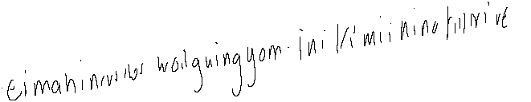
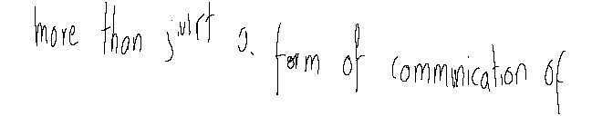
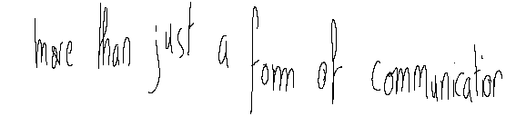

# GAN for Handwritten Texts

PyTorch implementation of the article "[Generative Adversarial Network for Handwritten Text](https://arxiv.org/abs/1907.11845)"

## Dataset Prepartation

### IAM
- Download `lineStrokes-all.tar.gz` and `ascii-all.tar.gz` [here](http://www.fki.inf.unibe.ch/databases/iam-on-line-handwriting-database/download-the-iam-on-line-handwriting-database)
- Extract `lineStrokes-all.tar.gz` and `ascii-all.tar.gz` to `./data/raw`


## Running the code


### Prediction Network
- Pre-train generator:
```bash
python train.py --mode prediction --batch_size 128 --b 0
```

- Pre-train discriminator:
```bash
python train.py --mode prediction --batch_size 16 --g_path <generator_path>
```

- Adversarial training:
```bash
python train.py --mode prediction --batch_size 16 --b 3 --g_path <generator_path> --d_path <discriminator>
```

Please fill in the placeholder with corresponding model fullpath. An example run is given as follows:
```bash
python train.py --mode prediction --batch_size 16 --b 3 --g_path models/prediction_generator_40.pt --d_path models/discriminator_160.pt 
```

- Generate handwritten texts:

```bash
python sample.py --mode prediction --b 5 --g_path <generator_path> --num_samples 8
```


Example Outputs:




### Synthesis Network

- Pre-train generator:

```bash
python train.py --mode synthesis --batch_size 16 --b 0
```

- Pre-train discriminator:

```bash
python train.py --mode synthesis --batch_size 16 --g_path <generator_path>
```

- Adversarial training:

````bash
python train.py --mode synthesis --batch_size 16 --b 3 --g_path <generator_path> --d_path <discriminator_path>
````

Please fill in the placeholder with corresponding model fullpath. An example run is given as follows:

```bash
python train.py --mode synthesis --batch_size 16 --b 3 --g_path models/synthesis_generator_20.pt --d_path models/discriminator_160.pt 
```

- Generate handwritten texts:

```bash
python sample.py --mode synthesis --b 5 --g_path <generator_path> --text 'generated texts' --num_samples 8
```


Example Ouputs:






## Acknowledgement

The source code of generator is mainly based on [rnn-handwriting-generation](https://github.com/snowkylin/rnn-handwriting-generation). We appreciate their excellent work.
